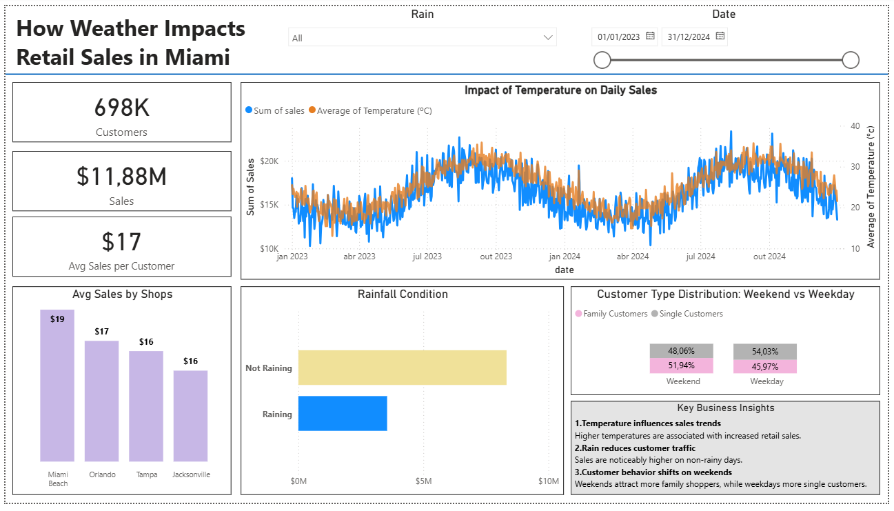
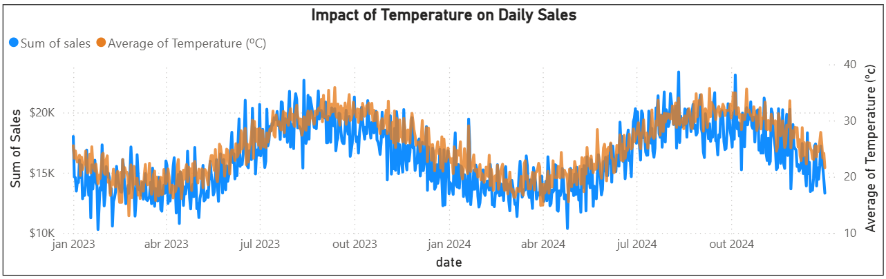
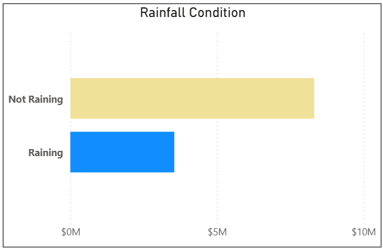
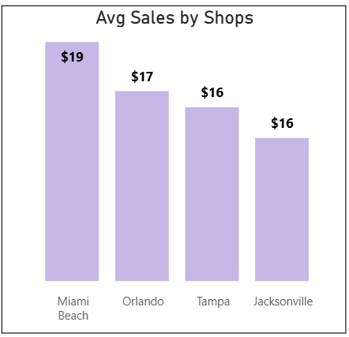
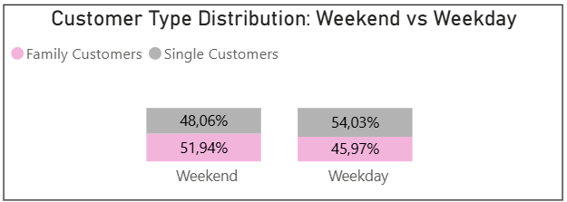

# Retail Sales Analysis: How Weather Impacts Retail Sales in Miami Shops

End-to-end data analysis project exploring how **weather patterns influence retail sales** across multiple stores in Florida using **MySQL and Power BI**.

---

# Business Context

Four retail shops operate in Florida:

- Miami
- Orlando
- Tampa
- Jacksonville

Management suspects that **weather conditions significantly impact customer demand**, but lacks clear insights on how temperature, rainfall, and customer demographics affect sales performance.

Understanding these drivers can help improve:

- staffing decisions
- inventory planning
- promotional strategies

---

# Problem Statement

Daily retail sales fluctuate significantly, but leadership does not fully understand **why these variations occur**.

Without clear insights into the drivers of demand, it is difficult for managers to:

- forecast staffing needs
- optimize inventory levels
- plan promotions effectively

---

# Project Goal

Provide **data-driven insights** into how weather conditions and customer demographics influence retail sales.

The project aims to support **better operational planning, staffing allocation, and marketing decisions.**

---

# Tools & Technologies

- **MySQL** — data storage and SQL transformations  
- **SQL** — data joining and feature creation  
- **Power BI** — data visualization and dashboard creation  
- **CSV datasets** — sales, weather, and customer survey data

---

# Data Sources

The analysis uses three datasets covering **two years of daily observations**:

- `sales_2yrs.csv` → retail sales and customer traffic
- `weather_2yrs.csv` → daily weather conditions
- `survey_2yrs.csv` → customer demographic distribution

These datasets were integrated into a **MySQL database** and combined using SQL for unified analysis.

---

# Data Preparation

The datasets were joined using SQL based on the **date field**, creating a unified analytical table.

Additional features were engineered including:

- weekend vs weekday indicator
- temperature conversion (F → C)
- sales per customer metric

The SQL transformation script can be found in [`sql/create_sales_weather_view.sql`](sql/create_sales_weather_view.sql)


---

# Analysis Objectives

The analysis focuses on answering key business questions:

1. How strongly do **temperature and rainfall affect daily sales**?
2. Which **shop performs best**, and why?
3. What is the **customer composition** (families vs singles, male vs female)?
4. Are there **seasonal patterns in sales**?
5. What **actions should management take** based on the insights?

---

# Dashboard Overview

<p align="center">
  
</p>

The Power BI dashboard integrates sales, weather, and customer data to provide an interactive view of performance drivers.

---

# Key Visualizations

## Temperature vs Sales



Higher temperatures tend to correlate with increased retail sales, suggesting stronger customer activity during warmer periods.

---

## Rainfall Impact



Sales are noticeably higher on **non-rainy days**, indicating that weather conditions significantly influence store traffic.

---

## Sales by Shop



Miami shows the highest average sales performance, potentially influenced by tourism and higher foot traffic.

---

## Customer Behavior



Customer patterns vary between **weekdays and weekends**:

- Weekends attract more **family shoppers**
- Weekdays see a higher share of **single customers**

---

# Key Insights

1. **Temperature strongly influences sales trends**  
   Warmer days are associated with increased retail activity.

2. **Rain negatively impacts store traffic**  
   Sales decline during rainy days.

3. **Customer behavior shifts during weekends**  
   Families shop more frequently on weekends.

4. **Store performance varies by location**  
   Miami leads in sales performance compared to other locations.

---

# Business Recommendations

Based on the analysis, retail managers should consider:

- **Increasing staff and inventory during hot summer periods**
- **Running promotions or discounts during rainy days**
- **Expanding marketing efforts in Miami during peak tourism seasons**
- **Building loyalty programs in lower-performing locations like Jacksonville**
- **Targeting family-focused promotions on weekends**

---

# 📁 Project Structure

```
retail-sales-analysis-powerbi

data/
   sales_2yrs.csv
   survey_2yrs.csv
   weather_2yrs.csv

sql/
   create_sales_weather_view.sql

dashboard/
   Retail_Sales_Analytics_Weather.pbix

images/
   dashboard_overview.png
   temperature_sales_trend.png
   rainfall_impact.png
   sales_by_shop.png
   customer_distribution.png

README.md
```

---

# Future Improvements

Possible next steps for this project include:

- building **predictive models for sales forecasting**
- incorporating **holiday effects**
- testing **weather-driven promotion strategies**
- expanding the analysis to **additional retail locations**

---

# Author

Data analysis project developed as part of a **data analytics portfolio** demonstrating skills in:

- SQL
- Power BI
- Data integration
- Data visualization
- Business insight generation
